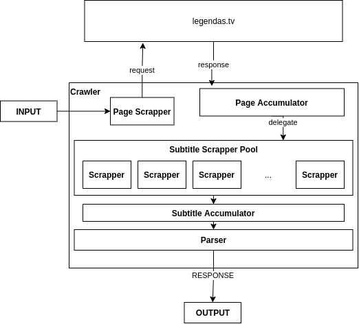

# Crawler do legendas.tv

Esse crawler tem como objetivo principal recuperar legendas encontradas por um determinado termo de busca

# Ambiente de Desenvolvimento
**Kernel** 5.10.10-1-MANJARO

**Nodejs** v12.16.3

**Docker** v20.10.2, build 2291f610ae

# Execução

Antes de qualquer uma das alternativas, é necessário criar (ou alterar) o arquivo `.env` na raiz do projeto, e adicionar o seguinte conteúdo:

```dotenv
uname=nome_de_usuario_do_legendas_tv
passwd=senha_do_usuario_do_legendas_tv
```

Caso essa etapa não seja seguida, uma excessão será lançada no inicio do programa.

## Standalone
É possível executar de maneira standalone utilizando o comando 

```shell
yarn install
yarn start "os simpsons"
```

ou até mesmo

```shell
npm install
npm start "os simpsons"
```

## Docker
Também é possível utilizar em um ambiente isolado por meio de um Docker Container.

## Ambiente

O ambiente docker foi construído como base uma imagem estábel do nodejs, instalando alguns recursos adicionais para ser possível utilizar o **Chromium** (motor utilizado pelo **Puppeteer**).

### Build


```shell
docker build -t legendastv-crawler .
```

E executar a busca de maneira análoga à standalone da seguinte forma:

```shell
docker run -it --rm legendastv-crawler yarn start "os simpsons"
```

# Organização 

O crawler foi dividido em 3 partes principais

## Crawler
Nesse contexto, é a máquina de estados que navega pelas páginas do `legendas.tv`, realiza o login, e armazena as informações coletadas

## Scrapper

O scrapper é um pequeno escopo do **Crawler** que irá somente recuperar os itens estruturados da página previamente coletada.

## Parser

O parser é uma etapa do **Crawler** que trabalha os dados recuperados pelos scrappers, dando sentido para eles, tratando os dados e gerando informações

## Pipeline




Primeiramente, o login é efetuado, em seguida, a busca é iniciada, página por página **(Page Scrapper)** e acumulando os resultados encontrados **(Page Accumulator)** para uma busca futura pelas legendas individualmente, porém em paralelo **(Subtitle Scrapper Pool)**. Uma vez que a última página dos resultados foi encontrada, todas as legendas encontradas passarão por um tratamento individual em sua página individual para a extração das informações **(Subtitle Accumulator)** e os resultados serão processados para gerar uma resposta **(Parser)**, para assim serem mostrados na tela.

### Pool
Utilizei Lodash para separar as requisições em chunks para paralelizar o processo de navegação nas páginas

### Similaridade
Existe uma configuração para o coeficiente de similaridade na busca, contida no arquivo `config/default.ts`, que serve como limiar de poda no parser para aceitar ou não o resultado obtido.
